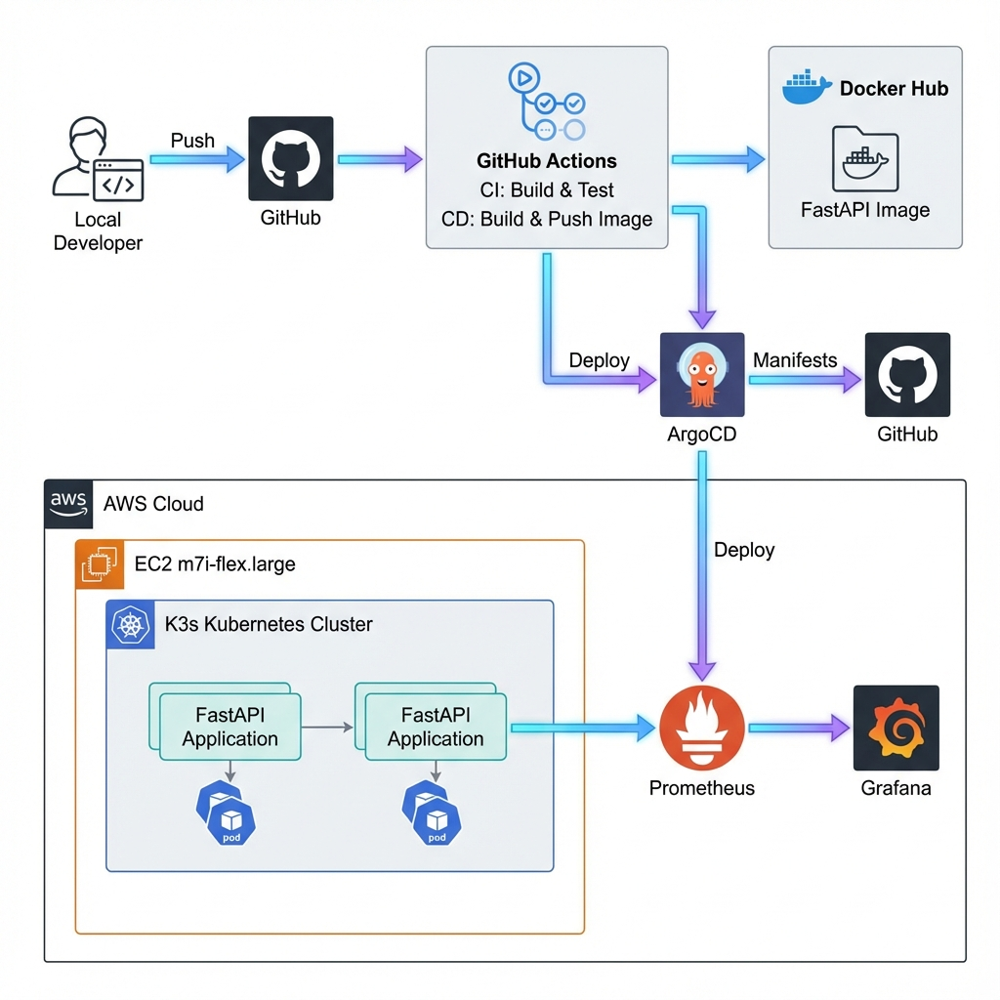
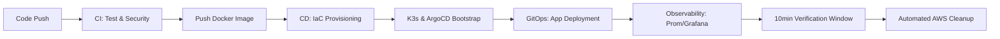

# 🚀 Zero-Touch DevOps: End-to-End GitOps Showcase

An industry-leading demonstration of a **Fully Automated Cloud-Native Lifecycle**. This project transforms a simple FastAPI application into a robust, secure, and self-healing system deployed on AWS using **Terraform**, **Kubernetes (K3s)**, and **ArgoCD**.

---

## 🏗️ Architecture: The Automated Lifecycle
This project is engineered to follow a complete **Build → Deploy → Observe → Destroy** cycle, maximizing efficiency and minimizing costs.

### 🔄 The Workflow Logic

---

## 🛠️ Tech Stack & Engineering Highlights

### 1. **Infrastructure as Code (IaC)**
*   **Terraform**: Automated provisioning of AWS EC2 (`m7i-flex.large`), VPC components, and IAM roles.
*   **State Management**: Secure S3 remote backend with state locking.
*   **Cloud-Native Bootstrapping**: EC2 `user_data` script handles OS hardening, K3s installation, and ArgoCD orchestration.

### 2. **GitOps & Kubernetes**
*   **ArgoCD**: Implements the "Source of Truth" pattern. Any manual change to the cluster is automatically corrected to match the Git repository.
*   **K3s**: High-performance, lightweight Kubernetes distribution tailored for cloud efficiency.
*   **Ingress Routing**: Specialized **Traefik** configuration enables path-based routing for the App, Prometheus, and Grafana under a single Public IP.

### 3. **Production CI/CD Pipelines**
*   **Continuous Integration**: Parallelized jobs for **Pytest**, **Flake8** (linting), **Bandit** (Sast), and **Trivy** (vulnerability scanning).
*   **Continuous Deployment**: Automated synchronization of Kubernetes manifests and Terraform lifecycle management.
*   **Lifecycle Awareness**: Includes an automated `cleanup` job that triggers `terraform destroy` after a 10-minute verification window.

### 4. **Modern Observability**
*   **Prometheus**: Real-time metrics collection from the FastAPI `/metrics` endpoint.
*   **Grafana**: Pre-configured visualization dashboards for cluster and application health.
*   **Integrated Hub**: The application home page serves as a central hub with direct links to all monitoring tools.

---

## 🔍 Access & Exploration Guide

### **1. Web Dashboards (Zero-Config)**
Once the deployment job in GitHub Actions turns green, access everything via your **Public IP**:
*   **🚀 FastAPI App**: `http://<PUBLIC_IP>/` (Central Hub)
*   **📊 Prometheus**: `http://<PUBLIC_IP>/prometheus`
*   **📈 Grafana**: `http://<PUBLIC_IP>/grafana` (admin/admin)
*   **📖 API Docs**: `http://<PUBLIC_IP>/docs`

### **2. Developer CLI (Zero-SSH Sync)**
I've implemented a custom **S3-based credential sync**. This allows you to securely link your local `kubectl` to the AWS cluster without needing SSH keys.
1.  **Run**: `chmod +x setup-kube.sh`
2.  **Run**: `./setup-kube.sh <PUBLIC_IP> <TF_STATE_BUCKET_NAME>`
3.  **Verify**: `kubectl get pods -A`

---

## 📈 Portfolio Objectives
This project serves as a definitive case study in:
- **Automation at Scale**: Reducing manual intervention to near-zero.
- **Cost Efficiency**: Ephemeral infrastructure management on AWS.
- **Security-First Culture**: Integrating security scans at every stage of the pipeline.
- **Unified Observability**: Making system health visible and actionable.

---
*Developed with ⚖️ by [Thomas Asamba](https://github.com/thomasasamba-bot)*
