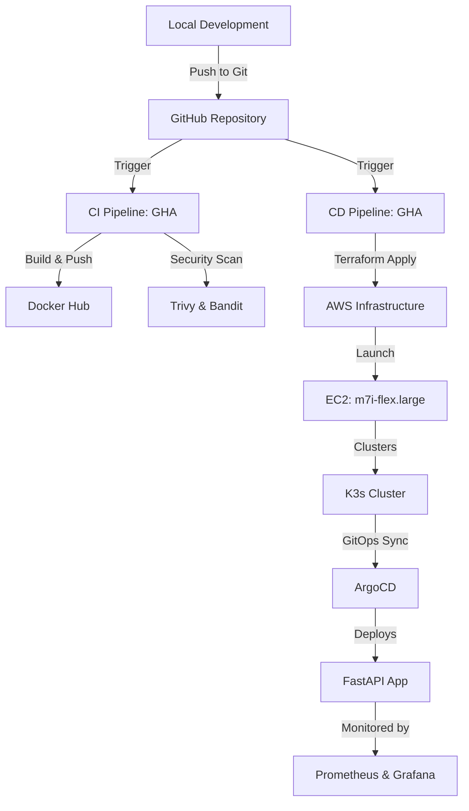

# Professional FastAPI CI/CD & GitOps Showcase

This project demonstrates a production-grade **End-to-End DevOps Pipeline** for a FastAPI application. It integrates Infrastructure as Code (IaC), Continuous Integration (CI), Continuous Deployment (CD), and GitOps principles to provide a robust, automated deployment lifecycle on AWS.

## 🚀 Architecture Overview

The system is built on a highly automated architecture that ensures stability, security, and scalability.

View Mermaid Logic Diagram

## 🛠️ Key DevOps Skills & Technologies

### 1. Infrastructure as Code (IaC) - Terraform
- Multi-environment setup using **Terraform**.
- **S3 Remote Backend** for secure state management and team collaboration.
- Automated provisioning of **VPC**, **Security Groups**, **IAM Roles**, and **m7i-flex.large** EC2 instances.

### 2. Containerization - Docker
- **Dockerized** FastAPI application using multi-stage builds for minimal image size.
- Automated image tag management within the CI/CD pipeline.

### 3. CI/CD Pipeline - GitHub Actions
- **Continuous Integration**: Automated linting (**Flake8**), security scanning (**Bandit**, **Trivy**), and Docker image building.
- **Continuous Deployment**: Automated Terraform plan/apply and GitOps manifest updates.
- Robust secret management using GitHub Secrets.

### 4. GitOps - ArgoCD
- Industry-standard **GitOps** flow using **ArgoCD**.
- Automatic synchronization of Kubernetes manifests from the repository to the live cluster.
- Self-healing capabilities to ensure the desired state is always maintained.

### 5. Kubernetes - K3s
- Lightweight **K3s** cluster deployment on AWS.
- Configured **Inbound/Outbound** rules for secure access.
- Managed **Resources Requests/Limits** to prevent container starvation.

### 6. Observability & Security
- **Monitoring**: Integrated **Prometheus** for metrics collection and **Grafana** for visualization.
- **Security**: Automated vulnerability scanning and least-privilege IAM policies.
- **Logging**: Advanced EC2 launch logging for easier troubleshooting.

## 💻 Setup & Usage

### Prerequisites
- AWS Account & Credentials.
- GitHub Account with repository specific secrets (`AWS_ACCESS_KEY_ID`, `AWS_SECRET_ACCESS_KEY`, `DOCKER_USERNAME`, `DOCKERHUB_TOKEN`, `TF_STATE_BUCKET`).

### Local Development
1. Clone the repository.
2. Install dependencies: `pip install -r requirements.txt`.
3. Run locally: `uvicorn app.src.main:app --reload`.

### Triggering Deployment
Simply push your changes to the `main` branch. The GitHub Actions pipeline will:
1. Build and push the Docker image.
2. Update the infrastructure via Terraform.
3. Update the Kubernetes manifests, triggering an ArgoCD sync.

## 🔍 How to Access & Observe

### 1. The FastAPI Application
Once the deployment job finishes, get the **Public IP** of your EC2 instance from the AWS Console or Terraform outputs.
- **Home Endpoint**: `http://<PUBLIC_IP>/`
- **Swagger Docs**: `http://<PUBLIC_IP>/docs`

### 2. Observability Stack (Prometheus & Grafana)
Observability is baked into the cluster! To access these internal tools, use **Port Forwarding**.

#### **Prometheus (Metrics Collection)**
Monitor raw metrics and query your system's health.
1. Run: `kubectl port-forward svc/prometheus-service 9090:9090 -n monitoring`
2. Access: `http://localhost:9090`

#### **Grafana (Visualization)**
Beautiful dashboards for infrastructure monitoring.
1. Run: `kubectl port-forward svc/grafana-service 3000:3000 -n monitoring`
2. Access: `http://localhost:3000`
3. Credentials: `admin` / `admin`

> [!NOTE]
> Resource requests and limits have been specifically tuned for this cluster to ensure the monitoring stack remains stable on a single node without causing resource starvation.

## 📈 Portfolio Highlights
This project serves as a comprehensive demonstration of:
- **Automation First** mindset.
- **Infrastructure as Code** mastery.
- **Secure DevOps** practices.
- **Cloud-Native** architecture design.

---
*Created by [Thomas Asamba](https://github.com/thomasasamba-bot) as a professional DevOps showcase.*
