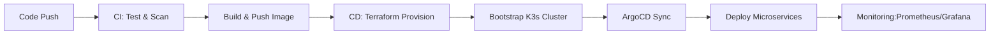

# 🚀 Zero-Touch DevOps: End-to-End CI/CD + GitOps Platform

[](https://github.com/thomasasamba-bot/fastapi-ci-cd-project/actions/workflows/ci.yaml)
[](https://github.com/thomasasamba-bot/fastapi-ci-cd-project/actions/workflows/cd.yml)
[](https://www.terraform.io/)
[](https://k3s.io/)
[](https://argoproj.github.io/argo-cd/)

A production-grade, fully automated **DevSecOps Platform** demonstrating the power of **GitOps**, **Infrastructure as Code**, and **Self-Healing Systems**. This project bootstraps a complete Kubernetes environment on AWS from scratch, deploys a secure FastAPI microservice, and manages its entire lifecycle automatically.

---

## 🏗️ Architecture & Workflow

This project implements a "Zero-Touch" philosophy: developers just push code, and the platform handles the rest.



### Key Engineering Highlights
- **Ephemeral Infrastructure**: The entire cloud environment (EC2, VPC, IAM) is provisioned on-demand via **Terraform**.
- **True GitOps**: **ArgoCD** ensures the cluster state *always* matches the Git repository. Manual changes are automatically reverted.
- **Security First**: Integrated vulnerability scanning (**Trivy**), linting (**Flake8**), and SAST (**Bandit**) in the pipeline.
- **Cost efficient**: Automatic teardown capabilities to prevent zombie resources.

---

## 🛠️ Technology Stack

| Domain | Technology | Usage |
|:---|:---|:---|
| **Cloud Provider** | AWS (EC2, S3, IAM) | Underlying infrastructure |
| **IaC** | Terraform | automated infrastructure provisioning |
| **Orchestration** | K3s (Kubernetes) | Lightweight, production-ready cluster |
| **GitOps** | ArgoCD | Continuous Deployment & State Synchronization |
| **CI/CD** | GitHub Actions | Pipeline automation (Build, Test, Deploy, Destroy) |
| **Backend** | FastAPI (Python) | High-performance microservice |
| **Observability** | Prometheus & Grafana | Real-time metrics and dashboards |
| **Networking** | Traefik | Ingress controller for routing |

---

## 🚀 Getting Started

### Prerequisites
- AWS Account & Credentials
- GitHub Repository with Secrets configured:
  - `AWS_ACCESS_KEY_ID`, `AWS_SECRET_ACCESS_KEY`
  - `DOCKER_USERNAME`, `DOCKERHUB_TOKEN`
  - `TF_STATE_BUCKET` (S3 Bucket for Terraform state)

### 1. Local Development
Clone the repository and verify the app locally using the `Makefile`:

```bash
# Install dependencies
make install

# Run tests
make test

# Build Docker image
make build

# Run locally
make local
```

### 2. Deployment (The Magic ✨)
Trigger the CI/CD pipeline by pushing to the `main` branch. 
The system automates the entire lifecycle:
1.  **CI**: Builds & Tests (GitHub Actions).
2.  **CD**: Provisioning (Terraform)### 2. Verify Deployment & Observability
Once the CD pipeline finishes:

1.  **Get the App URL**:
    ```bash
    make status
    # Output: 3.235.xxx.xxx
    ```
2.  **Visit the App**: Open `http://<PUBLIC_IP>` in your browser. You will see the **DevOps Dashboard** with links to Swagger Docs, Grafana, and Prometheus.
3.  **Run Load Test** (To populate graphs):
    ```bash
    make install           # Install Locust
    make load-test IP=http://<PUBLIC_IP>
    ```
    - This opens Locust at `http://localhost:8089`.
    - Start a test with 50 users / 5 spawn rate.
    - Go to **Grafana** (link on App homepage) -> **Dashboards** -> **FastAPI Performance**.
    - Watch the real-time metrics (Requests/sec, Latency) update automatically!

### 3. Automated Lifecycle & Cleanup
To ensure cost efficiency, this project creates ephemeral environments:
- **Auto-Destroy**: A timer is set for **30 minutes** after deployment. If no confirmation action is taken, the `destroy` job automatically triggers to tear down EC2/VPC resources.
- **Manual Destroy**: You can run the "Destroy Infrastructure" workflow manually at any time.
- **Full Cleanup**: The destroy logic includes deleting the Terraform State S3 bucket to leave *zero footprint* on AWS.

---

## 📂 Project Structure

```
├── app/                  # FastAPI Application source code
│   ├── src/              # Application logic
│   ├── Dockerfile        # Container definition
│   └── tests/            # Pytest suite
├── infra/
│   ├── terraform/kubernetes/ # Terraform IaC for AWS & Kubernetes
│   └── kubernetes/       # K8s manifests (Deployment, Ingress)
├── .github/workflows/    # CI/CD Pipelines (CI, CD, Destroy)
└── Makefile              # Developer convenience scripts
```

---

*This project is part of a Cloud Engineering Portfolio demonstrating advanced automation patterns.*
